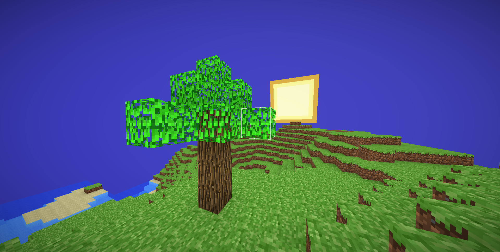
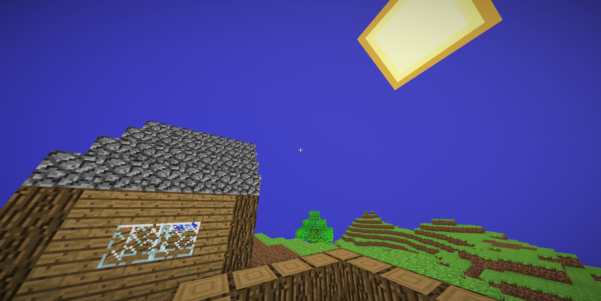

# BlockGL

**Minecraft Clone Voxel Engine written using C++23 and OpenGL**

### Why this project?
I chose to make a minecraft clone project because I wanted to learn more about computer graphics and engine level development. When I was a kid I always used to play minecraft it was my favorite game, the amount of Creativity and the Building was my favorite part. Thats how I came to the conclusion to make a mini minecraft clone since I saw a few Videos how other people recreated it I got onto vscode and started coding this minecraft clone.

## Gameplay

- Building Trees and Ambience

- Building a House


## How to Build this Project
- Build using CMake

- Clone the repo into a folder
```shell
    git clone --recursive https://github.com/omedcodes/BlockGL.git
```

- Build the project (Windows Mingw64) *I recommend built type to be Release and using mingw64 shell AS ADMINISTRATOR*
```shell
    cd BlockGL
    mkdir build
    cd build
    cmake .. -G "MinGW Makefiles" -DCMAKE_BUILD_TYPE=Release -DCMAKE_POLICY_VERSION_MINIMUM=3.5
```
- Once setup compile *it can compile little slower on low end devices again make sure it runs as ADMINISTRATOR*
```shell
    mingw32-make -j2
```

- Run
```shell
    ./BlockGL.exe
```

## Features

- Rendering
  - 
    - The chunks are hollow on the inside, so most of the blocks that are not visible are not sent to the GPU this improves the performance even on low end devices.
    - Each vertex in a chunk is only 4 bytes long to make the game as memory efficient as possible on the GPU side.
    - The game has animated textures and an animated skybox.
    - The world rendering has order independent transparency rendering implemented from
      this [paper](https://jcgt.org/published/0002/02/09/).
      and from
      [isti01](https://https://github.com/Isti01/glCraft)
- Gameplay
  - 
    - The game has very basic, minecraft like physics.
        - Survival Mode movement is default.
    - The game has block placing, block picking and block breaking.
    - The world is generated procedurally using a seed, and loaded dynamically as the player moves across it.

- Controls
  -
    - `Left Click` to break a block
    - `Middle Click` to pick a block
    - `Right Click` to place a block
    - `WASD or Arrow keys`  to move around
    - `Space` jump when physics is on
    - `Ctrl` sprinting faster
    - `Esc` to get mouse movement *pause mode*

## Libraries that I used

- [FastNoiseLite](https://github.com/Auburn/FastNoiseLite) - for terrain generation
- [GLAD](https://github.com/Dav1dde/glad) - for loading OpenGL functions
- [glfw](https://github.com/glfw/glfw) - for managing the window
- [glm](https://github.com/g-truc/glm) - a great math library for working with OpenGL
- [lodepng](https://github.com/lvandeve/lodepng) - for loading PNG textures

# Credits
### @omedcodes
### @isti01
### @WSAL Evan